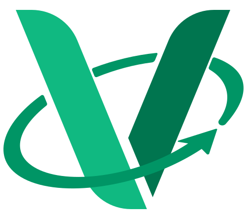

    

    
    
    
    
    

> [!IMPORTANT]\
> Verde is under heavy development and no stable release has been made yet.

# 📗 Verde
Verde is a synchronisation tool that will allow you to use off-platform tools such as [Visual Studio Code](https://code.visualstudio.com/) or [Git](https://git-scm.com/). You can learn more about Verde and what it can do in the [Introduction](https://verde.quantix.dev/guide/) section of our documentation.

## 🔧 Setup
In Development

## 🤝 Contributing
We are happy to accept any contributions to Verde so that we can build a better tool together.
There are a number of rules that are outlined in the [Contribution Guidelines](./.github/CONTRIBUTING.md) so that development is efficient and fast.

## 💼 License
Verde is licensed under the Mozilla Public License Version 2.0.
You can find the license in the [LICENSE](./LICENSE.txt) file or at [https://opensource.org/license/mpl-2-0/](https://opensource.org/license/mpl-2-0/).

The Verde logo was created by [@AnUnderratedPerson](https://github.com/AnUnderratedPerson).
